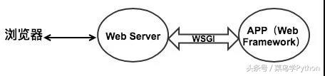

# Flask
Flask 是一個輕量化的伺服器開發工具，適用於許多情況。輕量化並不代表功能缺乏，Flask 提供了很多的插件，讓使用者依據自己的需求加裝。

在使用 Flask 開發伺服器的時候，為了方便，預設會有 `templates` 和 `static` 在 python source tree 底下，`templates` 是放一些 html 檔案之類的，`static` 就是儲存一些靜態的檔案。

在建立 server 的時候要特別小心資訊安全的問題，就算使用者只有你一個人，這點不管在任何框架下都是需要被注意的，Flask 只會幫你做一個基本的檢查：cross-site scripting (XSS)。

# WSGI
Web Server Gateway Interface，為 Python 定義 Web serve 與 Web application 之間的溝通介面。自從 WSGI 出現後其他語言也出現了類似的介面。

wsgi Server -> wsgi middleware -> wsgi application

上面的每一個階段都是在 server 端
* server 負責接收使用者的請求
* middleware 負責轉交這切請求後 app 端(例如：URL 路徑之類的)。
* app 端做完，在依照原路傳回去給使用者。