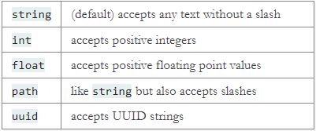

# A Minimal Application
```python=
from flask import Flask

app = Flask(__name__)

@app.route("/")
def hello_world():
    return "<p>Hello, World!</p>"
```

上面 code 做的事情如下
1. 先 import Flask class，WSGI application
2. 建立 Flask class，第一個參數通常都會放 `__name__`，作用應該是用來命名這個 app 的名字。例如你的檔案名稱叫做 minired，你的 server 名字就叫做 minired
4. `route` 是用來定義 URL 的
5. return HTML type data。

> 接下來儲存檔案，任何名字都可以，就是不要試 `flask.py` 因為這個名字與 Flask 本身會有衝突。


接下來，讓 server 跑起來，這邊提供兩種方法，
1. 使用 command 的方式
```command
linux
//先設定環境變亮，後面接的是 app 的名稱。
$ export FLASK_APP=minired

//在檔案存在的目錄下使用以下指令，server 就會開始執行了。
$ flask run

```
> 如果你的檔案叫做 app.py 或是 wsgi.py 就可以不用設變數

2. 使用 code 的方式
```python=
# 直接在剛剛上面程式碼的底下加上這段

if(__name__ == "__main__"):
	app.run()
```
接下來直接執行檔案就可以了。

# Routing
使用 route 定義在不同的目錄下顯示的資料。
```python=
@app.route('/')
def index():
    return 'Index Page'

@app.route('/hello')
def hello():
    return 'Hello, World'
```

## Variable Rules
使用 `<>` 符號可以表示變數，利用 HTML escape 的方式讓回傳特定的資料。這裡看到的 f 在 string 前面的意思是 python 內建的功能 formatting。可以用來在字串中間插入變數資料。
```python=
from markupsafe import escape

@app.route('/user/<username>')
def show_user_profile(username):
    # show the user profile for that user
    return f'User {escape(username)}'

@app.route('/post/<int:post_id>')
def show_post(post_id):
    # show the post with the given id, the id is an integer
    return f'Post {post_id}'

@app.route('/path/<path:subpath>')
def show_subpath(subpath):
    # show the subpath after /path/
    return f'Subpath {escape(subpath)}'
```
同時還可以利用 converter 強迫輸入的資料型態 (太神拉)


## Unique URLs / Redirection Behavior
 ```python=
 @app.route('/projects/')
def projects():
    return 'The project page'

@app.route('/about')
def about():
    return 'The about page'
 ```
 
 上面兩種用法的差別只在於 URL 結束後有沒有 `/`。
 * 有 `/`，的功用在於不管在存取的時候最後有沒有加上 `/` 都會成功存取。也就是說 `/projects/` 與 `/projects` 都會導向同一個地方。
 * 沒有 `/`，的功能就相反，如果沒有多打了一個 `/` 就會發生 404 Not Found，這種做法主要可以防止搜尋引擎拿到一樣的資料兩次。

## URL Building
```python=
from flask import url_for

@app.route('/')
def index():
    return 'index'

@app.route('/login')
def login():
    return 'login'

@app.route('/user/<username>')
def profile(username):
    return f'{username}\'s profile'

with app.test_request_context():
    print(url_for('index'))
    print(url_for('login'))
    print(url_for('login', next='/'))
    print(url_for('profile', username='John Doe'))
```
```commnad=
/
/login
/login?next=/
/user/John%20Doe
```
如果想要得到某個 function 在 server 中的路徑時，可以使用 `url_for()`，同時如果該 function 是需要丟入參數的，也可以直接輸入。使用 `url_for()` 的好處。
1. 相比直接寫 URL，使用函式的方式更為簡單易懂
2. 當路徑更改的時候，不需要一個一個改，維護起來比較簡單。


## HTTP Methods
```python=
from flask import request

@app.route('/login', methods=['GET', 'POST'])
def login():
    if request.method == 'POST':
        return do_the_login()
    else:
        return show_the_login_form()
```
HTTP 可以使用不同的方法來傳送資料，Flask 預設式 GET，可以在 `route()` 裡面使用 `method` 變數來將其更改為 POST，至於更改後 header 的更動 Flask 會幫你處理好。

# Rendering Templates
一般來說我們不會再 python 裡面直接寫 html，這樣看起來很醜又難維護。Flask 使用 [Jinja2](https://palletsprojects.com/p/jinja/) template engine 作為開發工具。

```python=
from flask import render_template

@app.route('/hello/')
@app.route('/hello/<name>')
def hello(name=None):
    return render_template('hello.html', name=name)
```

使用 render_template 呼叫你寫的 .html file，如果熟悉 Jinja2 的話，就知道，在呼叫的同時可以傳參數進去。

使用這種方式導入 html 預設有兩種方式，
1. 
```command
/application.py
/templates
    /hello.html
```

2. 
```command
/application
    /__init__.py
    /templates
        /hello.html
```

關於 jinja2 使用的方式就不細講，大概就是可以有變數、判斷式、繼承、導入之類的功能。

# Accessing Request Data
在 web application 中，與 client 的溝通非常重要

## Context Locals
