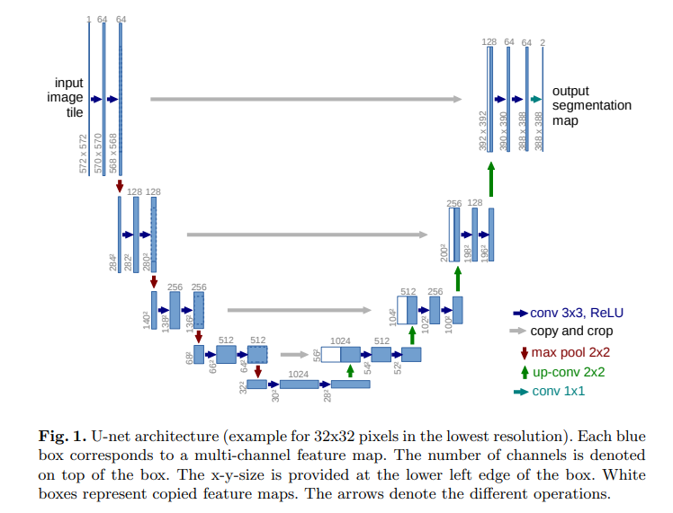

# U-Net: Convolutional Networks for Biomedical Image Segmentation
論文連結：https://arxiv.org/pdf/1505.04597.pdf

# 注意事項
* 這篇論文中的 U-net 並沒有使用一般的 Padding 技術(補零保持圖片不會變小)，因此每次做捲積後都會得到變小的圖片。
* 用到 Overlap-tile strategy，使用鏡像 Padding 的方式並不是在每一層捲積都加入，只在一開始的時候固定相片大小的時候使用。

總之，就是每次捲積是沒有做 Padding 的。鏡像 Padding 是用在固定相片輸入時的大小而已。

## 大綱
以往深度學習都需要大量的標記資料作為訓練，在這篇 paper 裡面提供了 data-augmentation 的方式來更有效的利用這些標記的資料。我們相信可以用少量的圖像資料就訓練出一個 end-to-end 的模型，模型主要用在生物醫學的圖像上面。

## 介紹
目前在圖像識別上的技術已經做到很好了，而主要的技術是使用 CNN 且這也是行之有年的方法。而隨著電腦視覺領域的發展，我們使用的標註資料逐漸增加，模型也隨之變深變大。

捲積神經網路一開始的功用是用在影像分類(圖片對應單一標籤)，但這在影像處理領域裡是遠遠不夠的，還有許多任務等待解決。像是物件偵測、生物醫學圖像之類的。我們期望不只輸出物體名稱，我們也期望機器能夠輸出物體位置。用傳統 CNN 是沒有辦法解決這類的問題，因此就有人提出 sliding window 的 CNN 來解決類似問題。

** Sliding window CNN**
Sliding window CNN 有兩個好處
* 第一是可以將物體定位；
* 第二是由於 Sliding window 會將原本的圖片切割，因此某種程度上也算是 Data augmentation。

而這種方法也有兩個主要的壞處
* 第一就是很慢，因為要掃過整張圖片，且 window 在掃的時候會有大量的重疊；
* 第二就是沒有辦法兼顧正確率與與 window 觀看的資料量。(之後其他人有提出讓最後分類的時候觀看多層的輸出解決這類的問題 Image Pyramid)

在這篇論文中，我們使用 "Fully convolution network" 作為基礎作為延伸，這樣做讓我們可以用更少的圖片產出更精確的圖像分割。(架構如下)

在這篇 Paper 中由於訓練資料極少，因此他們利用了非常大量的 Data augmentation，將圖片大量的變形，他們是說因為細胞也常常變形，所以利用在生物醫學的圖片上是沒有問題的，而且這樣還可以順便訓練模型面對變形的圖片時的結果依舊是不變的。這樣就不用給他變形的細胞圖片了。(雖然他有舉例誰也利用過相同的方法，但我還是覺得她在豪小)

## 模型架構
如上圖看到模型分為左半部與右半部，左半部稱為 contracting path；右半部稱為 expansive path。
* contracting path：與一般的 CNN 沒有太大的差異，細節也都在上面的架構圖有寫道。且在每次的 downsapling 後都會增加一倍的 feature map。
* expansive path：剛剛在 contracting path 增加的 feature map 會在這裡 upsampling 的時候除回來，並且會將 contracting path 對應的 feature map 接在一起(這樣做是為了得到物體的位置資訊)，由於沒有 padding 所以 contracting path 的 feature map 會被切割。

最後就是 1x1 convolution，這是為了將輸出的層數固定，層數隨著需要分類的總數而改變，這邊 feature map 是 2 的原因是因為只有兩個 class。

## 訓練
* 圖片 和 圖片的 segmentation
* Optimize 方式：使用 high momentum (0.99)，意思是讓過去大量的影響現在。
* 既然是使用 momentum，肯定會有 energy function。這裡的 Energy function 是對最後的 feature map 做像素級的 soft-max。公式如下：
	* $p_k(x)=exp(a_k(x))/\Big(sum^{K}_{k'=1}exp(a_{k'}(x))\Big)$
	* $p_k(x)$：第 k 個 feature map 的 soft-max (如果大於 0.5 就代表是那類)。
	* $a_k(x)$：第 k 個 feature map 在 x 位置的值

* Cross-Entropy 公式如下：
	* $E=\sum_xw(x)log(p_{l(x)}(x))$
	* 大部分都是一般的 CE 公式，只是是元素級的。
	* 不過這裡加入了 w(x) 當作權重，這樣可以讓我們在比較重要的地方加大懲罰。

上面提到的 w(x) 權重是預先就設定好的，例如：細胞與細胞間的邊建，如果沒有權重，機器就會覺得把他們連在一起也沒有差，所以就分不開細胞了。

計算 w(x) 的公式如下：
* $w(x)=w_c(x)+w_0\cdot exp\Big(-\frac{(d_1(x)+d_2(x))^2}{2\sigma^2}\Big)$
* $d_1$：代表距離第一近的邊界距離
* $d_2$：代表距離第二近的邊界距離
* 

## Data augmentation
Data augmentation 是當訓練資料很少的時候憑空變出資料的方法。這裡最主要的方式是將圖片隨機變形，變形的方法如下：

* 對於每一個 pixel 會有一個位移量。位移量是取 10 個 Pixel 的標準差的高斯分布。並且利用 雙三次插值(# Bicubic interpolation)

另一個 Data augmentation 的方法是在 contractin path 的最後加入 drop-out layer，某種意義上也算是 Data augmentation。
註：drop-out 主要被視為用在防止 overfiting 上。

## 結語
模型在生物醫學領域表現很好，並且可以利用少量的標註資料就完成訓練。而訓練的時間也只用十小時就完成了( NVidia Titan GPU 6 GB)。